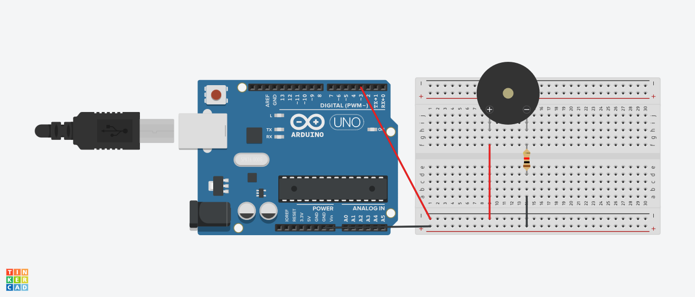

# Morse Code Encoder

This project convert text into morse code and outputs it using Buzzer (or any output device) connected to an Arduino board.

## Requirements
- Hardware
    - Arduino board
    - Output device (Buzzer)
    - Breadboard 
    - Resistor
    - Jumper wire
- Software
    - Arduino IDE

## How to use
1. Upload the code to your Arduino
2. Open Serial Monitor
3. Type a text to encode and press Enter

## Misc
Morse code was invented in early 19th century as a telecommunications method which encodes text characters as standardized sequences of two different signal durations: dot and dash. 

The timing in Morse code is based around the length of one “dot”

- Dot: 1 unit
- Dash: 3 unit
- Intra-character space (the gap between dits and dahs within a character): 1 unit
- Inter-character space (the gap between the characters of a word): 3 units
- Word space (the gap between two words): 7 units

In this project, 1 unit = 100ms (configureable in code)

